# [SK네트웍스 Family AI 캠프 9기 2차 프로젝트]<br>
✅ SKN AI FAMILY CAMP 9기 3팀<br>
✅ 개발 기간: 2025.02.07 - 2025.02.14
<br>
</br>

# 📚 목차
1. [팀 소개](#1-팀-소개)
- 팀명
- 멤버 소개

2. [프로젝트 개요](#2-프로젝트-개요)
- 프로젝트 명
- 프로젝트 소개
- 프로젝트 목표

3. [기술 스택](#3-기술-스택)

4. [WBS](#4-wbs)

5. [데이터 전처리 결과서 (EDA)](#5-데이터-전처리-결과서-eda)
- 데이터 수집 및 선정
- 데이터 확인
- 전처리
- EDA 시각화 및 인사이트

6. [인공지능 학습 결과서](#6-인공지능-학습-결과서)

7. [수행결과](#7-수행결과)
- 주요 기능

8. [기대 효과](#8-기대-효과)

9. [문제점 분석](#9-문제점-분석)

10. [추가 개선 방안](#10-추가-개선-방안)

11. [한 줄 회고](#11-한-줄-회고)
<br>

</br>


# 1. 팀 소개

### 팀명: 갤탈출 연구소📱


###  멤버 소개👨‍👩‍👧‍👦
<table align=center>
  <tbody>
    <tr>
      <td align=center><b>김정훈👨‍💻</b></td>
      <td align=center><b>박주은👩‍💻</b></td>
      <td align=center><b>이세진👨‍💻</b></td>
      <td align=center><b>임수연👩‍💻</b></td>
    </tr>
    <tr>
      <td align="center">
        <div>
          
        </div>
      </td>
      <td align="center">
        <div>
          
        </div>
      </td>
      <td align="center">
        <div>
          
        </div>
      </td>
      <td align="center">
        
      </td>
    </tr>
    <tr>
      <td><a href="https://github.com/Zayden0815"><div align=center>@Zayden0815</div></a></td>
      <td><a href="https://github.com/pprain1999"><div align=center>@pprain1999</div></a></td>
      <td><a href="https://github.com/tpwls9494"><div align=center>@tpwls9494</div></a></td>
      <td><a href="https://github.com/ohback"><div align=center>@ohback</div></a></td>
    </tr>
  </tbody>
</table>
<br><br><br>


# 2. 프로젝트 개요

## [프로젝트 명]
삼성 스마트폰 고객 이탈 예측
<br>
</br>

## [프로젝트 소개]
스마트폰 사용자의 이탈을 예측하고 이를 방지하기 위한 모델 개발 프로젝트를 진행 하였습니다.<br>


## [프로젝트 필요성] 

 <div align=center>
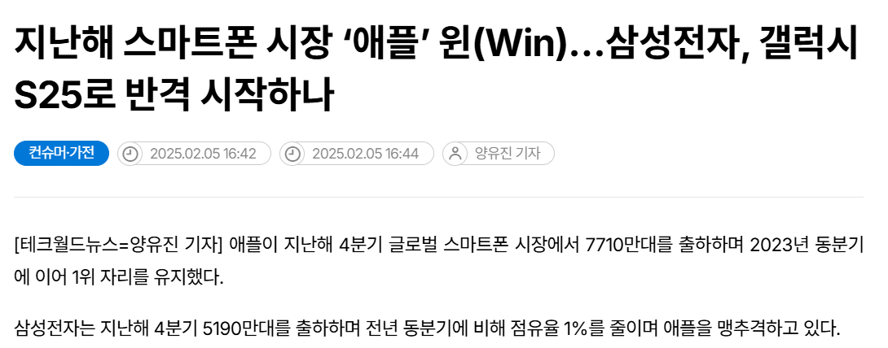
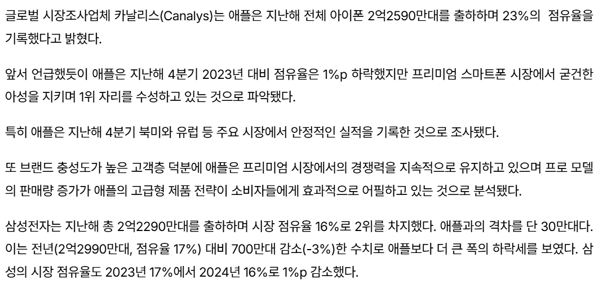
</div align=center>

<br>

스마트폰 시장의 경쟁이 치열해짐에 따라, 고객 이탈을 방지하는 것이 중요한 경영 전략이 되었습니다. 이탈을 예측하고 사전 대응함으로써, 고객 유지율을 높이고 브랜드 충성도를 강화할 수 있습니다. 또한, 프로젝트를 통해 고객 이탈을 예방하기 위한 효율적인 마케팅 전략을 수립하고, 비용 대비 효과적인 고객 유지 방안을 마련할 수 있을 것으로 기대됩니다. <br>
뉴스 출처: [https://www.epnc.co.kr/news/](https://www.epnc.co.kr/news/articleView.html?idxno=312152)

<br>


## [프로젝트 목표]

**고객 이탈 예측**: 삼성 스마트폰 사용자의 다양한 특성을 기반으로 이탈 확률을 예측하는 모델을 구축하여, 고객 이탈을 사전에 파악할 수 있도록 한다.

**이탈 고객 분석**: 이탈 가능성이 높은 고객을 식별하고, 그들의 특성을 분석하여 향후 이탈을 줄일 수 있는 맞춤형 전략을 제시한다.

**고객 유지 전략 강화**: 예측된 이탈 확률을 활용하여, 마케팅 및 고객 서비스 전략을 개선하고, 고객 유지율을 높이는 데 기여한다.

**비용 절감**: 고객 이탈을 사전 예방함으로써, 신규 고객 확보보다 적은 비용으로 고객 유지 효과를 극대화한다.

<br>

# 3. 기술 스택
### 개발 도구  
 

###  프로그래밍 언어  
  

###  데이터 분석  
 
  

###  데이터 시각화  
 


###  머신러닝  
  

### UI  
 

<br>

----


# 4. WBS
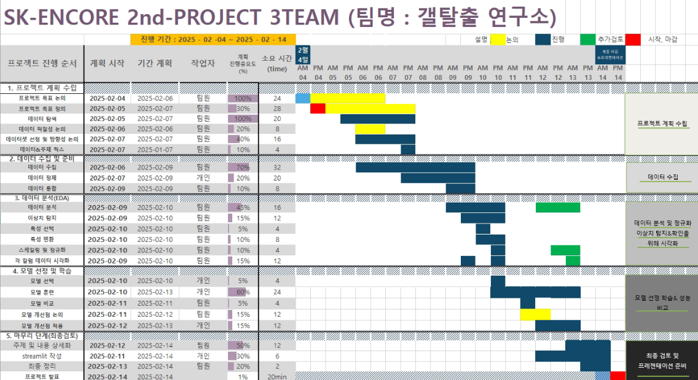

<br>

</br>


# 5. 데이터 전처리 결과서 (EDA)
## [ 데이터 수집 및 선정 ]
[**미디어 통계 포털**(https://stat.kisdi.re.kr/)](https://stat.kisdi.re.kr/kor/contents/ContentsList.html?subject=MICRO10&sub_div=D)에서 이루어진 **한국 미디어 패널 조사** 데이터셋을 분석하여 고객의 다양한 특성(연령, 요금, 사용 기간 등)에 따른 이탈 가능성을 예측하고, 이를 통해 고객 유지 전략을 개선할 수 있는 인사이트 제공 <br>


## [ 데이터 확인 ]
### ① 2021-2023년 데이터 병합
```python
# 데이터 병합
merged_df = pd.merge(phone22_df, phone21_df, 
                    on='pid',  # pid 컬럼으로 조인
                    how='inner',  # inner join 수행
                    suffixes=('_22', '_21'))  # 중복되는 컬럼명 구분을 위한 접미사
merged_df = pd.merge(phone23_df, merged_df, 
                    on='pid',  # pid 컬럼으로 조인
                    how='inner',  # inner join 수행
                    suffixes=('_23', ''))  # 중복되는 컬럼명 구분을 위한 접미사
```

### ② 데이터 확인
```python
<class 'pandas.core.frame.DataFrame'>
Index: 7324 entries, 0 to 8341
Data columns (total 73 columns):
 #   Column               Non-Null Count  Dtype 
---  ------               --------------  ----- 
 0   pid                  7324 non-null   int64 
 1   email_21             7324 non-null   int64 
 2   messenger_21         7324 non-null   int64 
 3   blog_21              7324 non-null   int64 
 4   cloud_21             7324 non-null   int64 
 5   call_check_21        7324 non-null   int64 
 6   service_purchase_21  7324 non-null   object
 7   money_transfer_21    7324 non-null   object
 8   cradit_card_21       7324 non-null   object
 9   agency_purchase_21   7324 non-null   int64 
 10  machine_purchase_21  7324 non-null   int64 
 11  phone_owner_21       7324 non-null   int64 
 12  data_21              7324 non-null   int64 
 13  dmb_21               7324 non-null   int64 
 14  agency_21            7324 non-null   int64 
 15  voice_service_21     7324 non-null   int64 
 16  data_service_21      7324 non-null   int64 
 17  use_date_21          7324 non-null   int64 
 18  brand_21             7324 non-null   int64 
 19  age_21               7324 non-null   int64 
...
 71  job_23               7324 non-null   int64 
 72  religion_23          7324 non-null   int64 
dtypes: int64(42), object(31)
```
<br>


## [ 전처리 ]

### ① object type → int64 변환 <br>
```python
# object 타입인 컬럼들 찾기
object_columns = phone_df.select_dtypes(include=['object']).columns

# object 타입 컬럼들을 숫자형으로 변환
for col in object_columns:
    phone_df.loc[:, col] = pd.to_numeric(phone_df[col], errors='coerce').astype('int64')
```

### ② 컬럼 삭제: NA값이 있는 컬럼들 확인 후 삭제
```python
na_columns = phone_df.columns[phone_df.isna().any()].tolist()
print("NA가 있는 컬럼들:")

for col in na_columns:
    na_count = phone_df[col].isna().sum()
    print(f"{col}: {na_count}개의 NA")
    print()

print("\n전체 NA 제거 전 데이터 크기:", phone_df.shape)

# NA가 있는 행을 모두 제거
phone_df = phone_df.dropna()
print("\n전체 NA 제거 후 데이터 크기:", phone_df.shape)
```

### ③ 로그변환 <br>
```python
# skew 계산할 컬럼
columns_to_check = ['machine_purchase_21', 'machine_purchase_22']

# 변환 후 skew 계산
skew_values = {col: skew(phone_df[col].astype('float64')) for col in columns_to_check}

# 결과 출력
print(skew_values)

# {'machine_purchase_21': np.float64(2.1455815034452455)'machine_purchase_22': np.float64(2.3205906721526333)

# 로그 변환
phone_df['machine_purchase_21'] = np.log1p(phone_df['machine_purchase_21'])
phone_df['machine_purchase_22'] = np.log1p(phone_df['machine_purchase_22'])
```

### ④ 연속형 변수 스케일링
```python
continuous_vars = ['agency_purchase_21', 'agency_purchase_22', 
                   'machine_purchase_21', 'machine_purchase_22', 
                   'use_date_21', 'use_date_22', 'salary_21', 'salary_22']

scaler = StandardScaler()
phone_df[continuous_vars] = scaler.fit_transform(phone_df[continuous_vars])
```

### ⑤ 이진 범주형 변수 (1, 2 -> 0, 1) 인코딩
```python
binary_vars = ['email_21', 'email_22', 'messenger_21', 'messenger_22', 'blog_21', 'blog_22',
               'cloud_21', 'cloud_22', 'call_check_21', 'call_check_22', 'money_transfer_21', 
               'money_transfer_22', 'cradit_card_21', 'cradit_card_22', 'dmb_21', 'dmb_22',
               'voice_service_21', 'voice_service_22', 'data_service_21', 'data_service_22',
               'job_21', 'job_22', 'religion_21', 'religion_22']

label_encoder = LabelEncoder()
for var in binary_vars:
    phone_df[var] = label_encoder.fit_transform(phone_df[var])
```


## [ EDA 시각화 및 인사이트 ]
- 이탈자 정의: 한 번이라도 이탈이 일어난 사람을 이탈자로 정의

1-0-0 삼성-기타-기타
1-1-0 삼성-삼성-기타
1-0-1 삼성-기타-삼성 (복귀자)
0-1-0 기타-삼성-기타

<<<<<<위부분 수정 필요>>>>>>

<br>

 - 22, 23년도 이탈자 비율

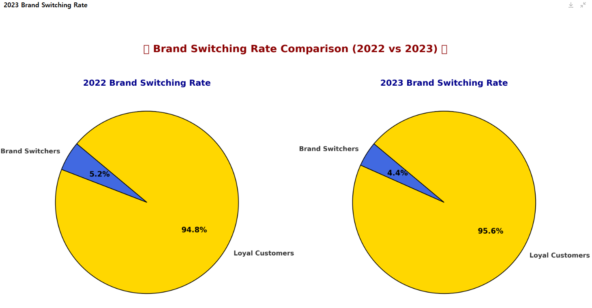

<br>

- 삼성과 기타 스마트폰 사용 비율

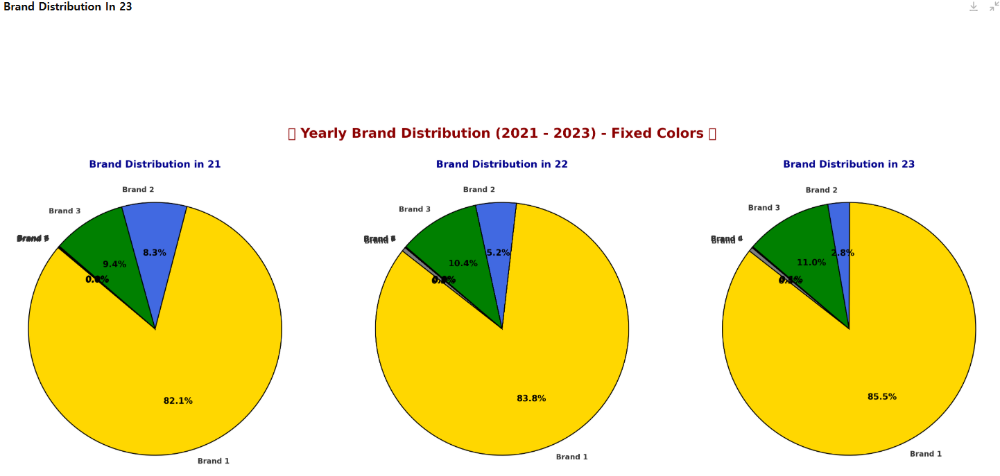

<br>

- 주요 변수 상관관계

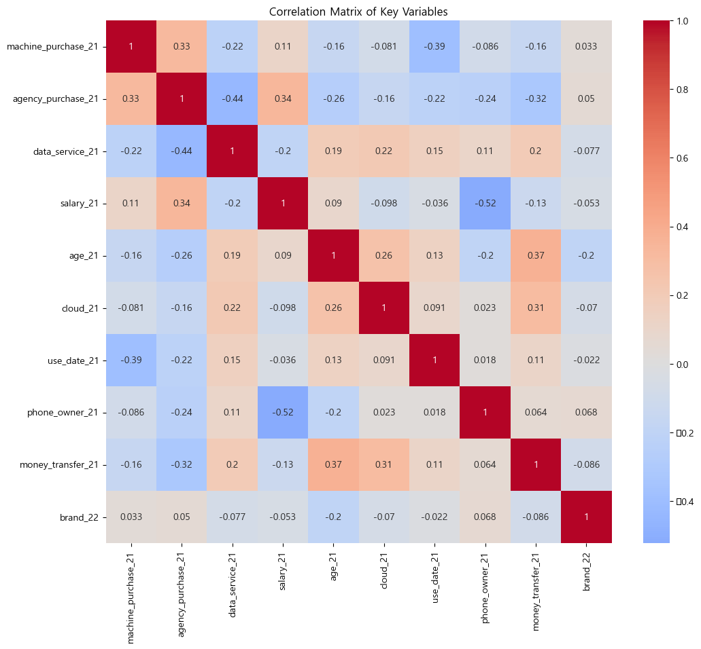

<br>

- 연속형 변수 시각화

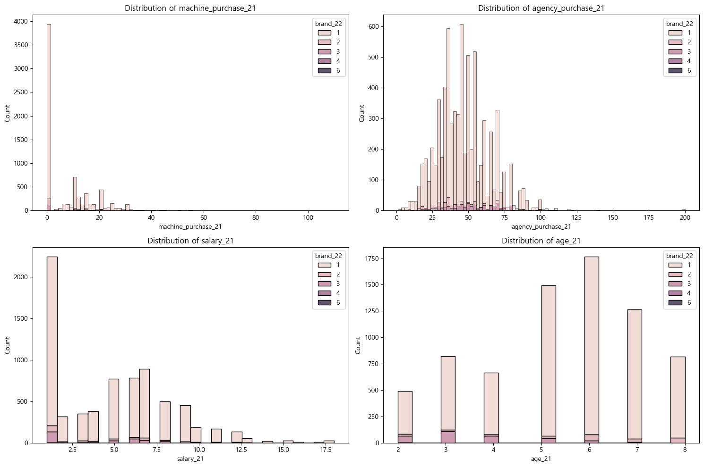


<br>

- 연도별 변수 시각화: 연도별 변수의 분포가 비슷한 형태로 나타남

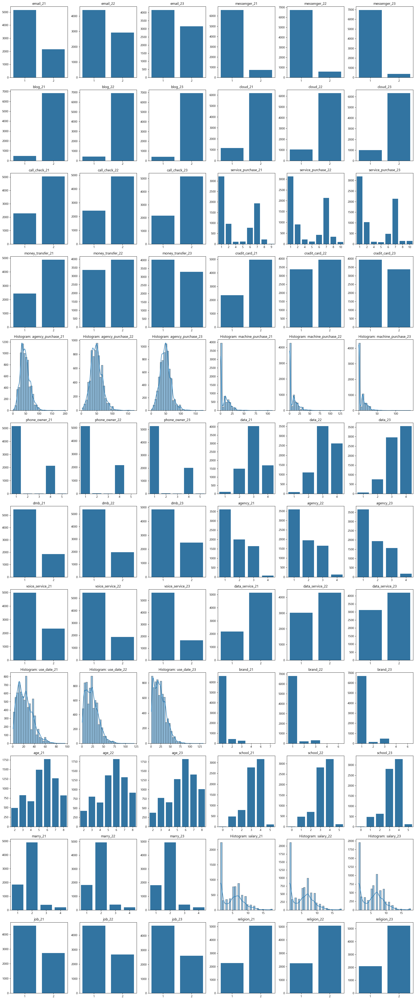

<br>

# 6. 인공지능 학습 결과서

| 모델명 | 정확도 | 설명 |
|----------|---------|---------|
| DecisionTree | | |
| RandomForest |  | 비교적 좋은 예측 성능을 보였지만, 모델의 해석이 어려운 편 |
| CatBoost |  |  |
| LightGBM |  |  |
| XGBoost | | | |
| Gradient Boosting |  |  |
| AdaBoost | | | |
| Ensemble ||||


<br>

</br>

# 7. 수행결과
### 주요 기능
이탈 분석 데이터를 분석하고 사용자 데이터를 입력하여 주요 이탈 요인 및 이탈 방지 인사이트 제공


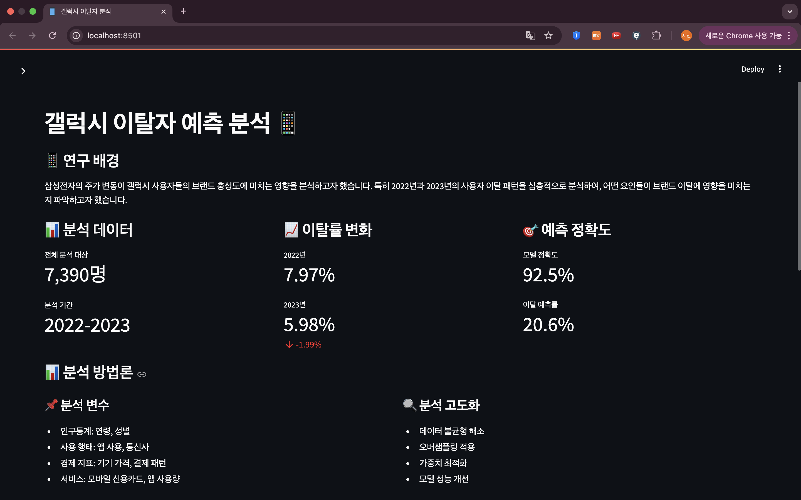
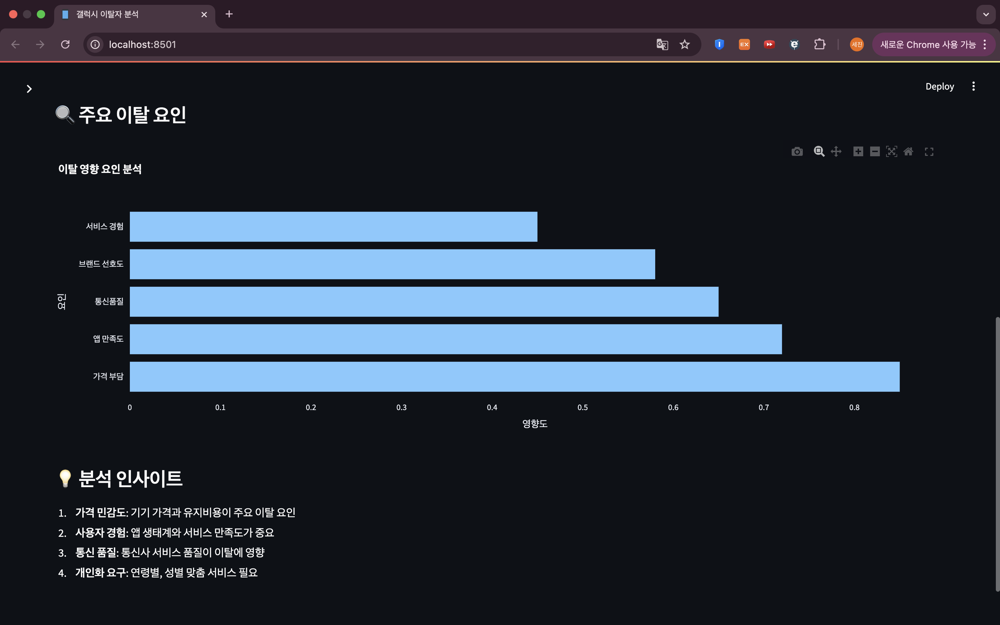
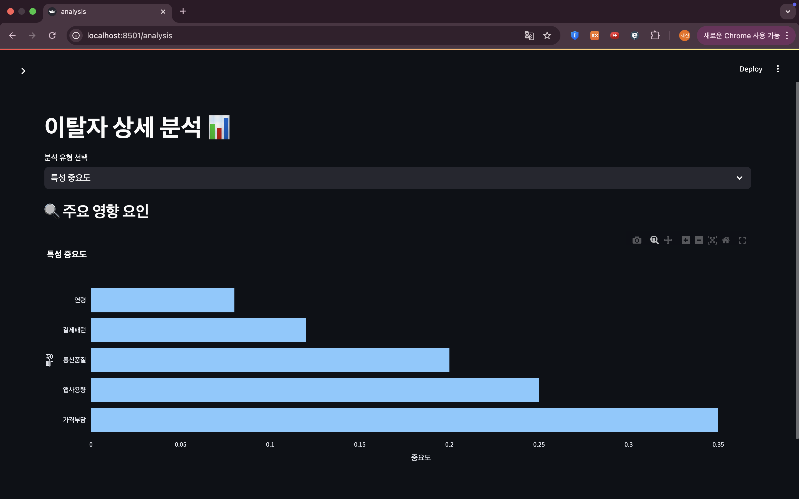
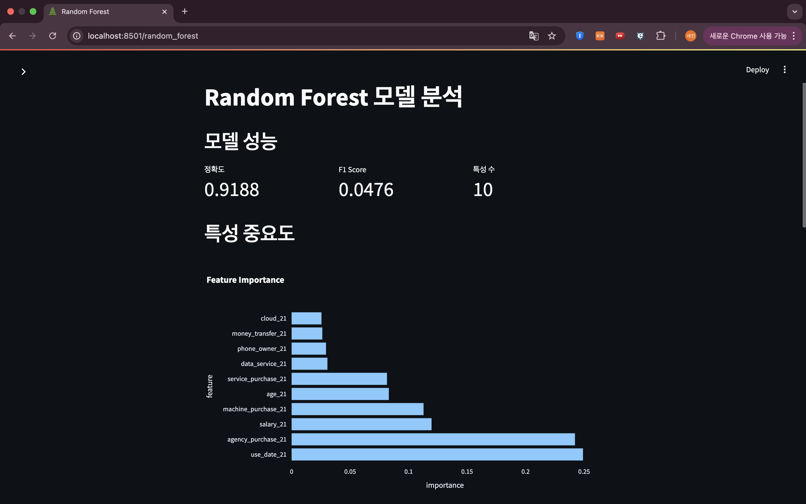
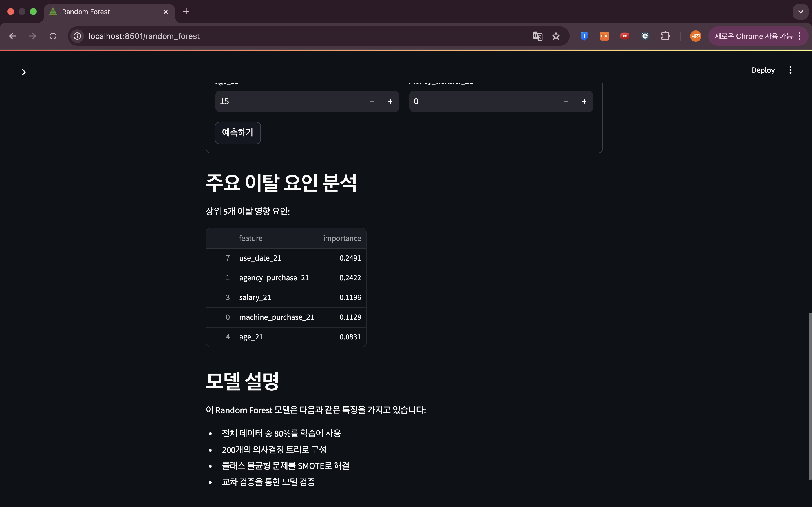
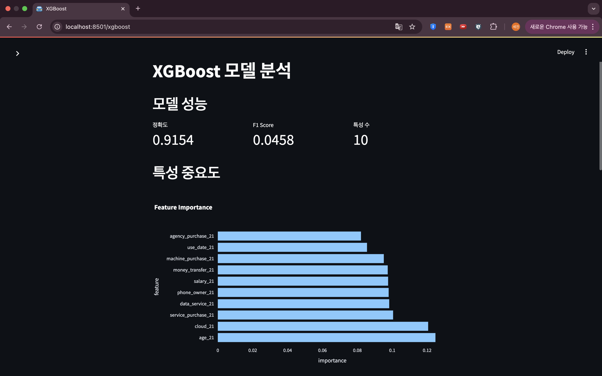
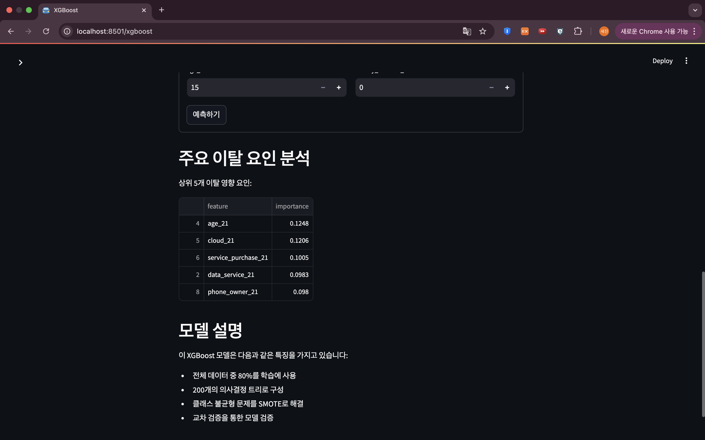
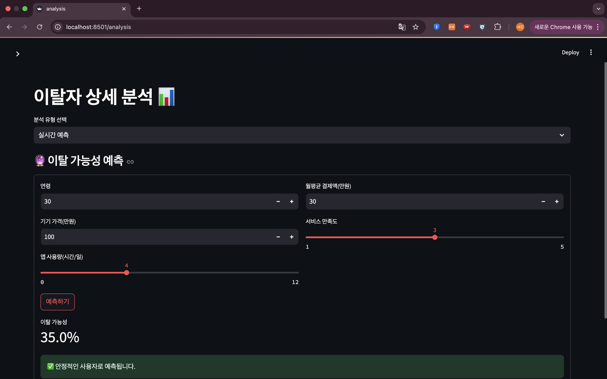

<br>

</br>


# 8. 기대 효과
 개별 사용자 ID(PID)를 활용함으로써, 각 이탈자의 구체적인 특성과 패턴을 파악할 수 있으며, 이 분석을 통해 단순히 이탈률을 예측하는 것을 넘어, 사용자의 이탈 결정에 더 큰 영향을 미치는지 파악한 정보들을 토대로 이탈 예측을 구현하고 Client(고객사)에게 인사이트를 제공 하며, 향후 기업에서 고객을 유지 할 수 있는 대응전략을 수립하는 데 있어 귀중한 기초 자료가 될 것입니다.

<br>

# 9. 문제점 분석
### ① 부족한 이탈자 샘플
전체 응답자 수 7324명 중 이탈자는 965명으로 이탈자에 대한 샘플 수가 부족하여 데이터 불균형이 컸습니다.

### ② 특징의 한계
전체 데이터와 이탈자, 이탈하지 않은 사람의 특성을 비교했을 때 응답의 분포가 거의 동일한 양상을 보여 이탈자 만의 특징을 잡아낼 변수가 부족했다고 판단됩니다.연도별 변수 24개 중 3개의 변수만이 유의미한 차이를 보였고 응답자와 직접적인 연관이 있는 나이, 직업, 결혼 등 6가지 컬럼으로만 모델을 학습 시켜보았을 때도 여전히 성능이 향상되지 않아, 파생변수를 생성하여 시도하였으나 성능 향상에 큰 영향을 미치지 못했습니다.

### ③ 데이터의 한계
사용한 데이터가 이탈자 추이를 볼 수 있는 데이터가 아닌 가구별 패널조사에서 파생되어 나온 가구원 설문조사이기 때문에 스마트폰 제조사 또는 요금제 등의 부분에서 같은 응답의 경향성이 짙었습니다. 그리하여 질문에 대한 응답 중 특정 응답이 과반수를 넘는 경우가 많았고 이로 인해 이탈자에 대한 특징이 두드러지지 않았다고 생각됩니다.

<br>

# 10. 추가 개선 방안
오버샘플링(SMOTE, RandomSampling, ADASYN), 언더샘플링, 하이퍼 파라미터 조정(그리드서치, 랜덤서치), 특성 중요도에 따른 변수 선택, 데이터 분할, 데이터 증강, 파생변수 생성 등을 시도했으나 모델의 성능 향상에 효과가 미미하였고 추가적인 분석을 통해 추가 개선 방안에 대하여 정리해 보았습니다.

### ① 데이터 확보 및 증강
외부 데이터를 활용하여 이탈 예측에 도움이 될 만한 변수 확보 필요

### ② 


# 11. 한 줄 회고
**김정훈🐉**: <br>
**박주은🐑**: <br>
**이세진🐂**: <br>
**임수연🐒**: <br>
